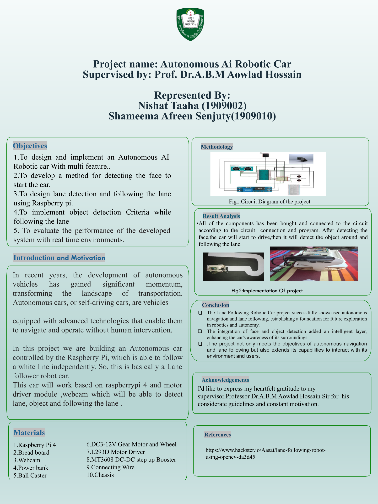
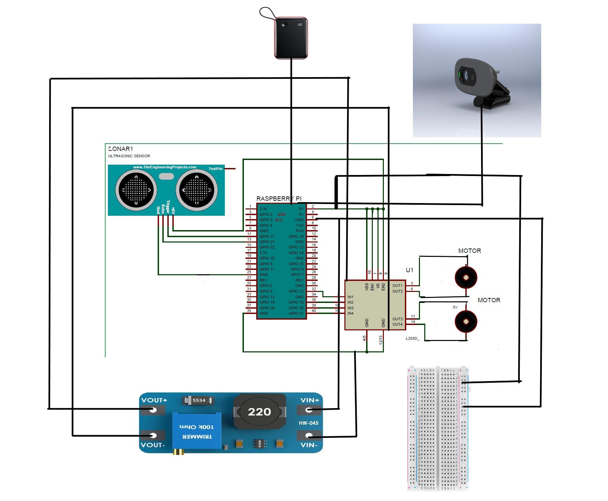

# Lane Following and object tracking car
This project implements an AI-powered vehicle system using image processing for lane detection, lane following, 
object recognition, and real-time object tracking. The solution operates on a Raspberry Pi with a dedicated camera module, while facial recognition provides secure access control for vehicle activation.

### Circuit Diagram

